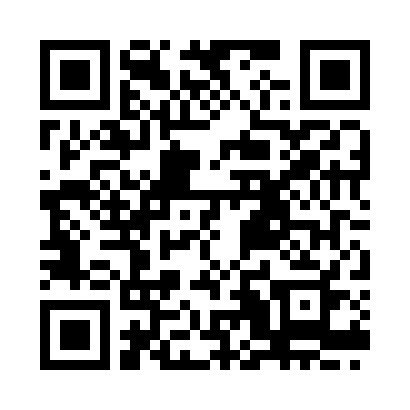

# AR Structural Biology Viewer

This project provides a **free** web-based AR viewer for 3D models for teaching structural biology, optimized for both iOS and Android devices. Students can scan QR codes to view different biological structures in augmented reality or 3D without any specific app.
You can clone this repository to add your own models. 
## Features

- **Cross-Platform Support**: Automatically detects the user's device (iOS or Android) and loads the appropriate 3D model format (USDZ for iOS, GLB for Android).
- **Augmented Reality**: Allows users to view 3D models in AR if their device supports it.
- **Dynamic Model Loading**: QR codes link to specific models, which are dynamically loaded based on the URL parameters.
- **Python script to generate free QR code**: you can easily generate the different QR code to link URL to specific models.

## Models

The following models are currently available:

1. **Alpha Helix**
   - iOS: `a-helix.usdz`
   - Android: `a-helix.glb`
2. **Beta Sheet**
   - iOS: `beta-sheet.usdz`
   - Android: `beta-sheet.glb`
3. **DNA**
   - iOS: `DNA.usdz`
   - Android: `DNA.glb`
4. **mCherry**
   - iOS: `mcherry.usdz`
   - Android: `mcherry.glb`

## Directory Structure

AR-Structural-Biology/
├── index.html
├── IOS/
│   ├── a-helix.usdz
│   ├── beta-sheet.usdz
│   ├── DNA.usdz
│   └── mcherry.usdz
├── Android/
│   ├── a-helix.glb
│   ├── beta-sheet.glb
│   ├── DNA.glb
│   └── mcherry.glb
└── QR-Code/
    ├── a-helix.png
    ├── beta-sheet.png
    ├── DNA.png
    └── mcherry.png
│
└── css/
│
└── js/

## Usage

### Viewing Models

1. **Scan the QR Code**: Use a QR code scanner on your mobile device to scan the QR code associated with the desired model.
2. **Open the Link**: The link will direct you to the web viewer, which will automatically detect your device and load the appropriate model.
3. **click on the cube at the bottom right**

### Hosting

To host the viewer on GitHub Pages or any other static site hosting service, ensure the above directory structure.

### Generating QR Codes

Generate QR codes that link to your hosted `index.html` with the appropriate model query parameter. For example:

- **Alpha Helix**: `https://jmb-scripts.github.io/AR-Structural-Biology/index.html?model=model1`
- **Beta Sheet**: `https://jmb-scripts.github.io/AR-Structural-Biology/index.html?model=model2`
- **DNA**: `https://jmb-scripts.github.io/AR-Structural-Biology/index.html?model=model3`
- **mCherry**: `https://jmb-scripts.github.io/AR-Structural-Biology/index.html?model=model4`

You can use a QR code generator in QR-Code directory
1. **Edit the Qr-code.py change the URL**
2. **Then in a terminal type:**

 **`python Qr-code.py`**

## QR Codes

Here are the QR codes for each model:

### Alpha Helix

### Beta Sheet

### DNA

### mCherry

## Example

Here is an example link for the Alpha Helix model:

- **URL**: `https://jmb-scripts.github.io/AR-Structural-Biology/index.html?model=model1`
